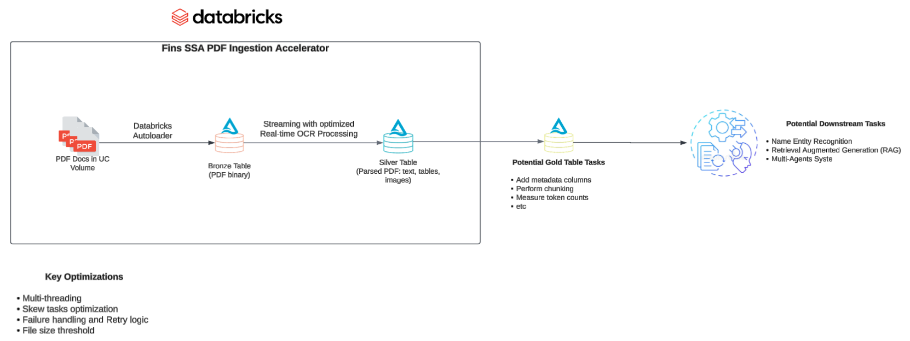
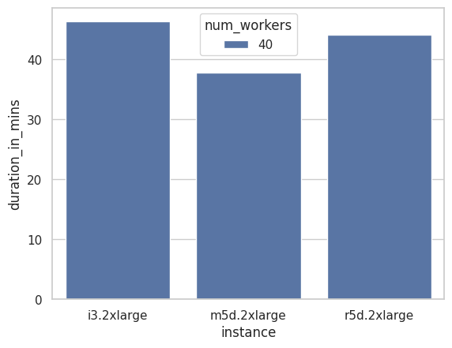
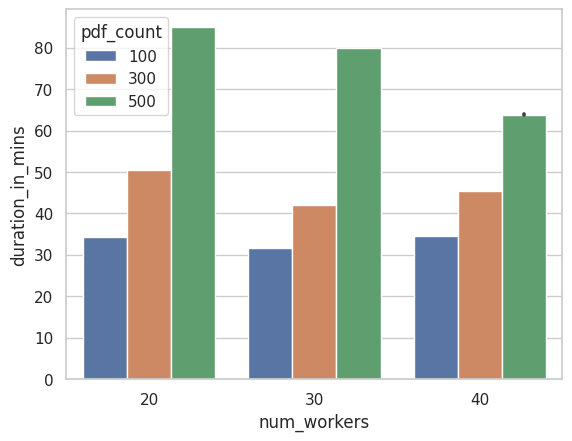

# pdf_ingestion



This project allows databricks users to ingest large number of complex pdf files from a 
Databricks Unity Catalog volume into a Databricks Delta table. The project is designed to be 
high-performant, scalable and fault-tolerant.

## Getting started

1. Install the Databricks CLI from https://docs.databricks.com/dev-tools/cli/databricks-cli.html

2. Authenticate to your Databricks workspace, if you have not done so already:
    ```
    $ databricks configure
    ```
3. Setup you bundle

    ```
    databricks bundle init pdf_ingestion_tempate
    ```

4. To deploy a development copy of this project, type:
    ```
    $ databricks bundle deploy --target dev
    ```
    (Note that "dev" is the default target, so the `--target` parameter
    is optional here.)

    This deploys everything that's defined for this project.
    For example, the default template would deploy a job called
    `[dev yourname] pdf_ingestion_job` to your workspace.
    You can find that job by opening your workpace and clicking on **Workflows**.

5. Similarly, to deploy a production copy, type:
   ```
   $ databricks bundle deploy --target prod
   ```

   Note that the default job from the template has a schedule that runs every day
   (defined in resources/pdf_ingestion_job.yml). The schedule
   is paused when deploying in development mode (see
   https://docs.databricks.com/dev-tools/bundles/deployment-modes.html).

6. To run a job or pipeline, use the "run" command:
   ```
   $ databricks bundle run
   ```

7. Optionally, install developer tools such as the Databricks extension for Visual Studio Code from
   https://docs.databricks.com/dev-tools/vscode-ext.html.

8. For documentation on the Databricks asset bundles format used
   for this project, and for CI/CD configuration, see
   https://docs.databricks.com/dev-tools/bundles/index.html.

## Performance Benchmarks

m5d.2xlarge i.e. A balanced cluster offer the best performance overall



Performance comparison between different instance types



Performance comparison between worker sizes


