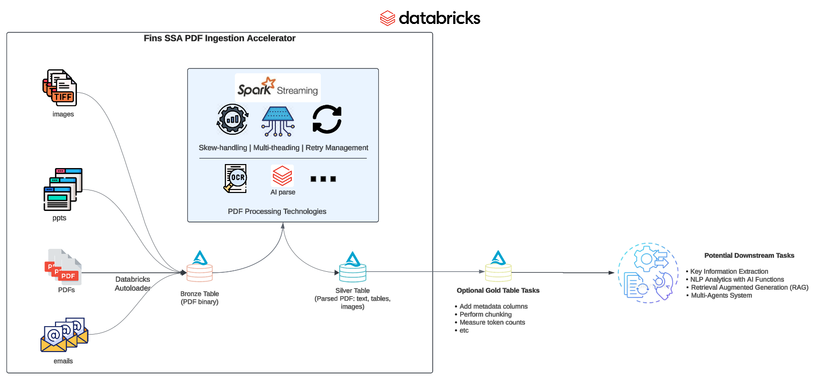

# pdf_ingestion

## Architecture



This project enable databricks users to ingest large number of unstructured files (e.g. PDF, Docx, PPTx, etc) from a Databricks Unity Catalog volume into a Databricks Delta table. The project is designed to be 
high-performant, scalable and fault-tolerant.

## Key Features

* Concurrency within microbatch with threadpools
* Automatic skewed tasks management
   * Users can set file size and page count threshold to bucket large data to seperate async jobs
   * Optional salted options to alleviate skewness in micro-batches
* Error handling and retry logic

## Getting started

1. Install the Databricks CLI from https://docs.databricks.com/dev-tools/cli/databricks-cli.html

2. Authenticate to your Databricks workspace, if you have not done so already:
    ```
    $ databricks configure
    ```
3. Setup you bundle

    ```
    databricks bundle init pdf_ingestion_template
    ```

* Follow the prompts to define your project name, set cloud environment, and set file size/page count threshold
* The databricks asset bundle job configurations will be auto created
* Review the main asset configuration `databricks.yml` for further customization for your workspace
  * Update `Variables` section with your workspace environment details
* Refer to [Databricks Asset Bundle Documentation](https://docs.databricks.com/dev-tools/bundles/index.html)

4. To validate a development copy of this project:

   validate default setting for dev workflow (Note that "dev" is the default target, so the `--target` parameter is optional here.)
    ```
    $ databricks validate deploy --target dev
    ```

   validate with custom variables
   ```
   databricks bundle validate --target dev --var="catalog=test,schema=unstructured_ingestion,volume=pdfs,num_workers=5,table_prefix=test_job,max_concurrent_async_runs=2
   ```


5. To deploy a development copy of this project:

   Deploy the dev workflow to a databricks workspace
    ```
    $ databricks bundle deploy --target dev
    ```

    This deploys everything that's defined for this project.
    For example, the default template would deploy a job called
    `[dev yourname] pdf_ingestion_job` to your workspace.
    You can find that job by opening your workpace and clicking on *Workflows*.

   deploy with custom variables
   ```
   databricks bundle deploy --target dev --var="catalog=test,schema=unstructured_ingestion,volume=pdfs,num_workers=5,table_prefix=test_job,max_concurrent_async_runs=2
   ```

6. Similarly, to deploy a production copy, type:

   ```
   $ databricks bundle deploy --target prod
   ```

   Note that the default job from the template has a schedule that runs every day (defined in resources/pdf_ingestion_job.yml). The schedule is paused when deploying in development mode (see https://docs.databricks.com/dev-tools/bundles/deployment-modes.html).


7. To run a job or pipeline, use the "run" command:
   ```
   $ databricks bundle run
   ```

8. Optionally, install developer tools such as the Databricks extension for Visual Studio Code from
   https://docs.databricks.com/dev-tools/vscode-ext.html.

9. For documentation on the Databricks asset bundles format used
   for this project, and for CI/CD configuration, see
   https://docs.databricks.com/dev-tools/bundles/index.html.

## Usage

### Databricks Job Variables

User can customize the following variables in the `databricks.yml` after bundle initialization 
or set with databricks CLI. These variables are used to configure the job and can be set to match 
your specific environment and requirements.

| Variable | Description                                                           | Default Value |
|----------|-----------------------------------------------------------------------|--------------|
| cloud_provider | cloud provider                                                        | aws          |
| node_type_id | worker node type                                                      | m5d.2xlarge  |
| async_node_type_id | async job worker node type                                            | m5d.4xlarge  |
| num_workers | number of workers                                                     | 40           |
| async_num_workers | number of workers for async job                                       | 1            |
| max_concurrent_async_runs | max number of concurrent async job runs                               | 10           |
| zone_id | AWS zone_id attribute                                                 | us-west-2a   |
| catalog | unity catalog name                                                    | my_catalog   |
| schema | schema name                                                           | my_schema    |
| volume | source file volume                                                    | my_volume    |
| checkpoints_volume | checkpoints volume name                                               | checkpoints  |
| reset_data | reset all data tables boolean flag                                    | true         |
| table_prefix | output table prefix                                                   | my_project   |
| file_format | input file format (extension)                                         | pdf          |
| parser_name | name of the parser, choices are `unstructured`, `databricks_ai_parse` | `unstructured` |
| strategy | Unstructured parser strategy setting, choices are 'auto', 'hi_res'    | `auto`        |

### Parsers

The currently supported parsers, file format

|                      | Databricks AI Parse                 | Unstructured OSS Parser (`auto` strategy)                                | Unstructured OSS Parser (`hi_res` strategy) | 
|----------------------|-------------------------------------|--------------------------------------------------------------------------|---------------------------------------------|
| Supported File Types | `pdf`, `jpg`, `jpeg`, `png`         | `pdf`, `pptx`, `docx`, `xlsx`, `eml`, `msg`                              | `pdf`, `pptx`, `docx`, `xlsx`, `eml`, `msg` |
| technology | agentic system with customer models | dynamtically choose between OCR and OCR + yolox based on document layout | OCR + yolox |

### Known Limitations

* The open source Unstructured API uses Yolox object detection model for `hi_res` strategy and `auto` strategy (dynamically determined). The Yolox model is hosted at huggingface hub. Depending on the time of the day and traffic condition, user may experience 429 error due to the rate limit from huggingface
* AI parse is currently in Private Preview, please reach out to your Databricks Account Team to enable access

## Comming Soon

* Memory management
* Map-reduce page splits option for large files
* Declaritive Document Processing


## Reference:

- [Databricks CLI](https://docs.databricks.com/aws/en/dev-tools/cli/)
- [Databricks Asset Bundle Tutorial](https://docs.databricks.com/aws/en/dev-tools/bundles/tutorials)
- [Spark Structured Streaming](https://docs.databricks.com/aws/en/structured-streaming/concepts)
- Databricks AI Parse
- [Unstructured OSS Parser](https://docs.unstructured.io/open-source/core-functionality/partitioning)
